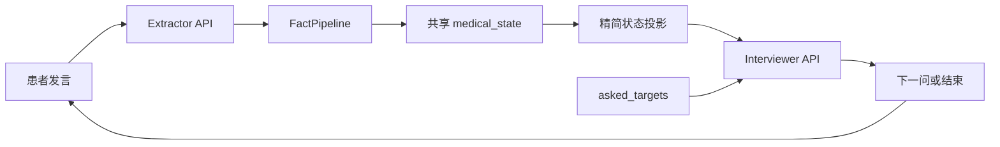

# AskMed

AskMed 将预问诊系统分为两个模块：

1. `extractor`：从患者当前发言抽取医学事实、可选术语标准化并维护问诊状态。
2. `interviewer`：读取结构化精简问诊状态，生成下一轮问题或结束问诊。

所有路径均以项目根目录解析，服务器命令应在 `AskMed/` 下执行。

## Project layout

```text
scripts/
├─ extractor/
│  ├─ pipeline/       # 校验、标准化、实体归并、状态管理
│  ├─ synthesis/      # 教师数据合成、修复、校验、分割、Alpaca
│  ├─ finetuning/     # Qwen3-4B LoRA 训练与测试
│  ├─ inference/      # LLaMA-Factory API 推理客户端
│  └─ terminology/    # ICD-10-CN / LOINC 导入
└─ interviewer/
   ├─ synthesis/
   ├─ finetuning/
   └─ inference/
```

## Environment

补充依赖记录在 `environment.yml`。训练环境还需要可用的 PyTorch、CUDA、PEFT、Transformers 和 LLaMA-Factory：

```bash
conda activate /disk/wzy/env/AskMed
llamafactory-cli version
```

## Current datasets

`data/dataset_info.json` 注册 extractor v3.1 的 train/valid/test，以及由它派生的 interviewer v1 三个数据集。问诊器文件会在教师合成和 Alpaca 转换完成后生成。

## Extractor synthesis

默认不分割；传入 `--split-ratios` 才按完整对话切分：

```bash
python -m scripts.extractor.synthesis.run_extractor_pipeline \
  --api-format openai \
  --base-url https://api.deepseek.com \
  --api-key "your-key" \
  --model deepseek-v4-flash \
  --source data/MedDG_clean.jsonl \
  --work-dir data/synthetic_extractor \
  --run-name extractor_v3 \
  --max-user-turns 1000 \
  --workers 3
```

启用逐轮术语标准化：

```bash
python -m scripts.extractor.synthesis.run_extractor_pipeline \
  ... \
  --terminology-db data/terminology/terminology.sqlite
```

传入数据库即启用标准化；不传则关闭。主合成数据保留标准编码，转 Alpaca 时自动保留 `normalized_name` 并清空 `standard_code/terminology`。

失败对话使用同一运行名整对话修复：

```bash
python -m scripts.extractor.synthesis.run_extractor_pipeline \
  ... \
  --run-name extractor_v3 \
  --repair-failed-dialogues
```

详细说明见 `scripts/extractor/synthesis/README.md`。

## Terminology

将合法获取的 ICD-10-CN 和 LOINC 文件放在 `data/terminology/sources/`，构建 SQLite：

```bash
python -m scripts.extractor.terminology.import_terminology \
  --icd-file data/terminology/sources/ICD-10-CN/disease.csv \
  --loinc-table data/terminology/sources/LOINC/LoincTable/Loinc.csv \
  --loinc-zh data/terminology/sources/LOINC/AccessoryFiles/LinguisticVariants/zhCN5LinguisticVariant.csv \
  --output data/terminology/terminology.sqlite
```

标准化由 `FactPipeline` 在每个 fact 生成后立即执行；不再需要整批离线标准化脚本。

## Fine-tuning

```bash
bash scripts/extractor/finetuning/run_extractor.sh check
bash scripts/extractor/finetuning/run_extractor.sh download
CUDA_VISIBLE_DEVICES=0 bash scripts/extractor/finetuning/run_extractor.sh train
CUDA_VISIBLE_DEVICES=0 bash scripts/extractor/finetuning/run_extractor.sh test \
  --terminology-db data/terminology/terminology.sqlite
```

配置位于 `configs/extractor/`。默认基座模型为 `Qwen/Qwen3-4B-Instruct-2507`，模板为 `qwen3_nothink`。

## Runtime inference

先启动 LLaMA-Factory OpenAI-compatible API：

```bash
llamafactory-cli api configs/extractor/extractor_qwen3_4b_api.yaml
```

另一个终端运行 AskMed 推理处理链：

```bash
python -m scripts.extractor.inference.run_inference \
  --base-url http://127.0.0.1:8000/v1 \
  --api-key EMPTY \
  --model Qwen3-4B-Instruct-2507 \
  --terminology-db data/terminology/terminology.sqlite \
  --input requests.jsonl \
  --output responses.jsonl
```

输入每行格式：

```json
{"dialogue_id":"demo-1","turn_id":0,"previous_doctor_question":null,"patient_utterance":"肚脐周围疼了三天","recent_context":[]}
```

推理输出先经过 schema/evidence 校验，再可选标准化并更新状态；失败重试一次，仍失败时本轮不更新状态。

## Interviewer

问诊器以 extractor v3.1 的逐轮状态和 MedDG 原对话为基础合成数据，并继承 v3.1 的对话级 train/valid/test 划分：

```bash
python -m scripts.interviewer.synthesis.run_interviewer_pipeline \
  --api-format openai \
  --base-url https://api.deepseek.com \
  --api-key "your-key" \
  --model deepseek-chat \
  --workers 3
```

微调独立的 Qwen3-4B LoRA：

```bash
bash scripts/interviewer/finetuning/run_interviewer.sh check
CUDA_VISIBLE_DEVICES=0 bash scripts/interviewer/finetuning/run_interviewer.sh train
CUDA_VISIBLE_DEVICES=0 bash scripts/interviewer/finetuning/run_interviewer.sh test
```

运行时架构：



提取器只更新医学状态，问诊器只更新 `dialogue_control`。双 API 编排方式见 `scripts/interviewer/inference/README.md`。

## Tests

```bash
python -m unittest discover -s tests -v
python -m py_compile scripts/extractor/pipeline/*.py
```
